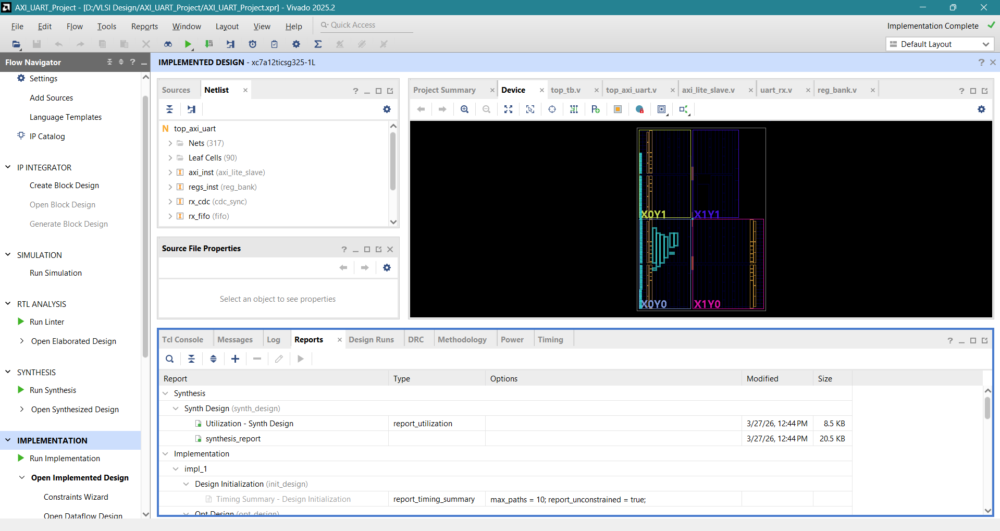

# AXI4-Lite UART SoC Peripheral (Verilog HDL)

This project implements an AXI4-Lite based UART SoC peripheral in Verilog HDL. The design includes UART transmitter, UART receiver, FIFO buffers, baud rate generator, clock domain crossing (CDC), register bank and interrupt generation. The design was simulated, synthesized, implemented and a bitstream was generated for Artix-7 FPGA using Xilinx Vivado.

---

## Features
- AXI4-Lite Slave Interface
- UART Transmitter (TX)
- UART Receiver (RX)
- TX FIFO and RX FIFO
- Baud Rate Generator
- Clock Domain Crossing (CDC)
- Interrupt Generation
- Register Bank
- Functional Simulation
- RTL Synthesis
- Implementation
- FPGA Bitstream Generation

---

## Block Diagram
AXI4-Lite → Register Bank → FIFO → UART TX/RX → Interrupt

---

## Simulation Waveform

The waveform shows UART transmission, UART reception, RX data ready signal and interrupt generation.

---

## RTL Schematic

RTL schematic generated from Vivado showing AXI interface, register bank, UART modules, FIFO and baud generator.

---

## Implementation Result

Post-implementation design after placement and routing on Artix-7 FPGA.

---

## Bitstream Generated

Bitstream successfully generated for FPGA hardware implementation.

---

## Tools Used
- Verilog HDL
- Xilinx Vivado
- Artix-7 FPGA
- AXI4-Lite Protocol

---

## Author
**Ruthvik R**
